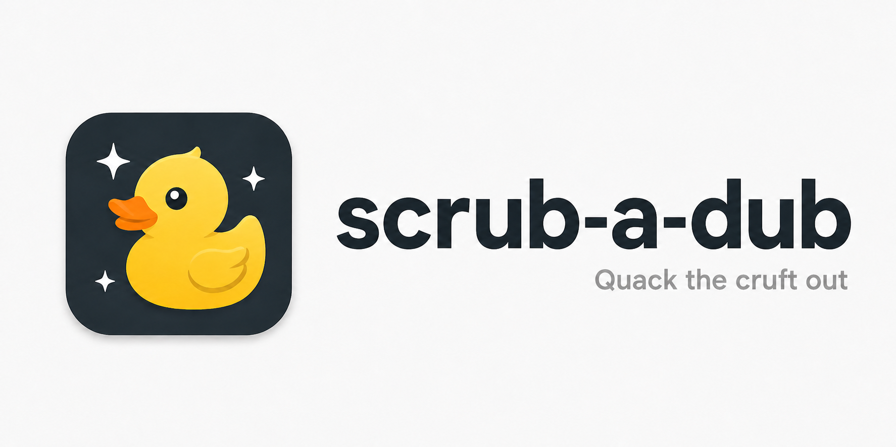
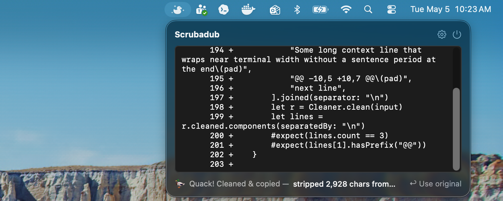

# scrub-a-dub

A macOS menu bar utility for cleaning terminal-copied text.





Scrubadub strips terminal-width padding, ANSI escape codes, excess outer blank lines, and other paste noise from Claude Code CLI output and similar right-padded terminal text.

Paste text into the menu bar app, and Scrubadub puts the cleaned version back on your clipboard. The Homebrew install also includes a `scrubadub` CLI for shell pipelines.

## Install

Scrubadub requires macOS 14 or newer.

Homebrew Cask is the recommended install path:

```bash
brew install --cask steven-haddix/tap/scrubadub
```

You can also download the zipped app from the [latest GitHub release](https://github.com/steven-haddix/scrub-a-dub/releases/latest).

The cask installs:

- `Scrubadub.app`, the menu bar app.
- `scrubadub`, the command-line cleaner.

## Uninstall

If you installed with Homebrew:

```bash
brew uninstall --cask scrubadub
```

If you installed from a GitHub release, quit Scrubadub and delete `Scrubadub.app` from Applications.

## Use the App

1. Launch Scrubadub from Applications.
2. Click the menu bar icon.
3. Paste terminal output into the Scrubadub window.
4. Paste anywhere else. Your clipboard now contains the cleaned text.

Scrubadub also has an optional clipboard watcher in Settings. When enabled, it silently rewrites the clipboard only when the copied text looks like padded terminal output.

## Use the CLI

The CLI reads UTF-8 text from standard input, writes cleaned text to standard output, and prints cleanup stats to standard error.

```bash
pbpaste | scrubadub | pbcopy
```

You can also clean a file:

```bash
scrubadub < messy-output.txt > clean-output.txt
```

Check the installed version or show CLI help:

```bash
scrubadub --version
scrubadub --help
```

## What Gets Cleaned

Always:

- Trailing whitespace on every line.

Default-on:

- ANSI escape codes, including color sequences, OSC sequences, and charset switches.
- Outer blank lines at the beginning and end of the paste.
- Common left padding from every non-empty line.
- Hard-wrapped prose rejoined into normal paragraphs.

Default-off:

- Collapse long runs of blank lines.
- Strip box-drawing borders and leading gutter characters.

The menu bar app exposes these settings in the gear menu. The CLI currently uses the default cleaner options.

## Inspiration

Scrubadub stands on two prior efforts worth checking out on their own:

- **[Trimmy](https://github.com/steipete/Trimmy)** by [Peter Steinberger](https://github.com/steipete) — a tightly-focused macOS menu bar utility that shaped what I wanted Scrubadub to *feel* like to use.
- **[cleanup-claude-code-paste](https://simonwillison.net/2026/Apr/6/cleanup-claude-code-paste/)** by [Simon Willison](https://simonwillison.net) — a post that named the exact padded-terminal-paste pain I'd been hitting and sketched a fix.

Scrubadub combines those ideas into a native macOS menu bar app and a brew-installable Unix-pipeable CLI, local-only and telemetry-free. Thanks to both for putting their work out where I could learn from it.

## Troubleshooting

If macOS blocks the downloaded app, install with Homebrew or open System Settings > Privacy & Security and allow the app from there.

If `scrubadub` is not found after installing the cask, make sure Homebrew's binary directory is on your `PATH`:

```bash
brew --prefix
```

Then check that the cask installed correctly:

```bash
brew list --cask scrubadub
```

## Developer Setup

Scrubadub is a Swift Package that requires Swift 6 and macOS 14 or newer.

```bash
git clone https://github.com/steven-haddix/scrub-a-dub.git
cd scrub-a-dub
swift test
swift run Scrubadub
```

Run the CLI from source:

```bash
pbpaste | swift run scrubadub | pbcopy
```

Build without launching:

```bash
swift build
```

## Project Layout

```text
Sources/
  ScrubadubCore/   Pure cleaning library with no I/O or UI
  Scrubadub/       SwiftUI menu bar app
  scrubadub-cli/   stdin to cleaned stdout command
Tests/
  ScrubadubCoreTests/
```

`ScrubadubCore.Cleaner.clean(input, options:) -> CleanResult` is a pure function. Both the app and CLI call it, so cleaner behavior should be covered in `ScrubadubCoreTests`.

## Contributing

Small fixes are welcome. A good pull request usually includes:

- A clear description of the user-facing behavior being changed.
- Focused tests when cleaner behavior changes.
- Screenshots or notes for visible app changes.
- Conventional commit-style PR titles, such as `fix: preserve whitespace in code blocks` or `docs: clarify Homebrew installation`.

Before opening a PR, run:

```bash
swift test
```

## Release

Release packaging lives in `Scripts/`, and the manual GitHub Actions release flow is documented in [docs/release.md](docs/release.md).

```bash
Scripts/package_app.sh release
```

That creates a zipped `.app`, a SHA256 file, and a generated Homebrew cask at `dist/homebrew/scrubadub.rb`.
